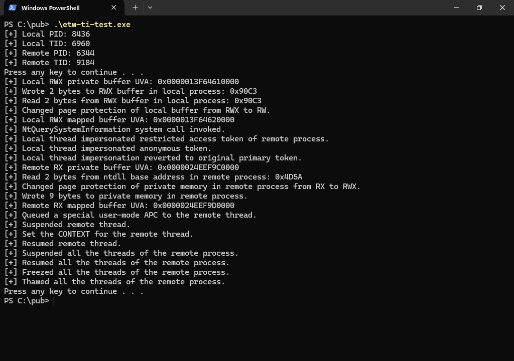
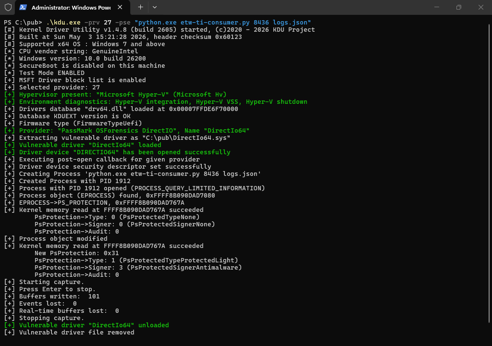

# EVENSTAR - ETWTIConsumer

## Version

- `v1.0`

## Brief

- `Python`-based consumer for the `Microsoft-Windows-Threat-Intelligence` `ETW` provider, powered by `pywintrace`.
- The purpose of this script is to monitor the telemetry generated by a target process identified by its `PID`.
- The script leverages `KDU`'s `BYOVD` capabilities to gain access to the `Secure ETW` channel.
- The script does not require the machine to be put into test-signing mode or any `VBS` features to be disabled.

## Usage

- Build `KDU`.
- Install `Python`.
- Get `pywintrace` package.
- Get `psutil` package.
- Launch the script like so:
```console
kdu.exe -prv 27 -pse "python.exe etw-ti-consumer.py [PID of process to be monitored] [output filename]"
```





Find the sample logs [here](./Misc/logs.json).

## Limitations

- Per-process logging flags are enabled only once during script startup, so opt-in telemetry events involving processes created afterward may not be emitted.
- Stack traces are not enriched, so a `WinDbg` `TTD` trace file or a memory dump file from the same run might be required to resolve the stack frames.
- Events are buffered in memory and written to disk only during a clean termination of the script, so any unhandled exception or premature termination may result in the loss of the full capture.

## Tested OS Versions

- `Windows 11 25H2 Build 26200 Revision 8655 64-bit`

## References

1. [KDU](https://github.com/hfiref0x/KDU)
2. [Introducing pywintrace: A Python Wrapper for ETW](https://cloud.google.com/blog/topics/threat-intelligence/introducing-pywintrace-python-wrapper-etw)
3. [pywintrace](https://github.com/fireeye/pywintrace)
4. [psutil documentation](https://psutil.readthedocs.io/stable/)
5. [psutil](https://github.com/giampaolo/psutil)
6. [Secure ETW](https://download.microsoft.com/download/0/B/5/0B5EC8E7-1313-4477-AE4F-8F3C9FEBC1DB/MMPC%20Threat%20Intelligence%20August%202015.pdf)
7. [An End to KASLR Bypasses?](https://windows-internals.com/an-end-to-kaslr-bypasses/)
8. [Uncovering Windows Events](https://jonny-johnson.medium.com/uncovering-windows-events-b4b9db7eac54)
9. [Introduction to Threat Intelligence ETW](https://undev.ninja/introduction-to-threat-intelligence-etw/)
10. [From alert to driver vulnerability: Microsoft Defender ATP investigation unearths privilege escalation flaw](https://www.microsoft.com/en-us/security/blog/2019/03/25/from-alert-to-driver-vulnerability-microsoft-defender-atp-investigation-unearths-privilege-escalation-flaw/)
